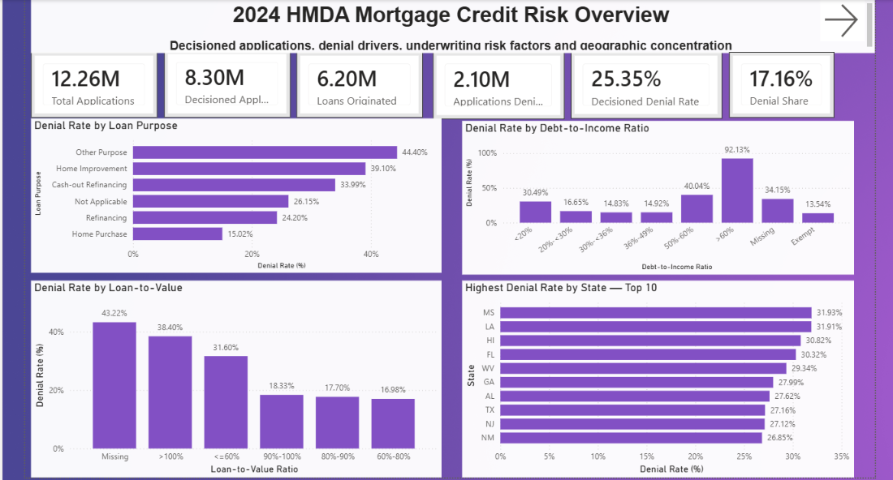
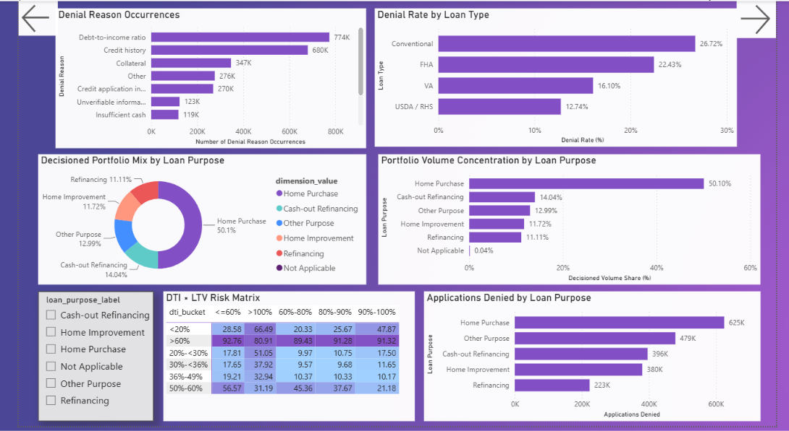
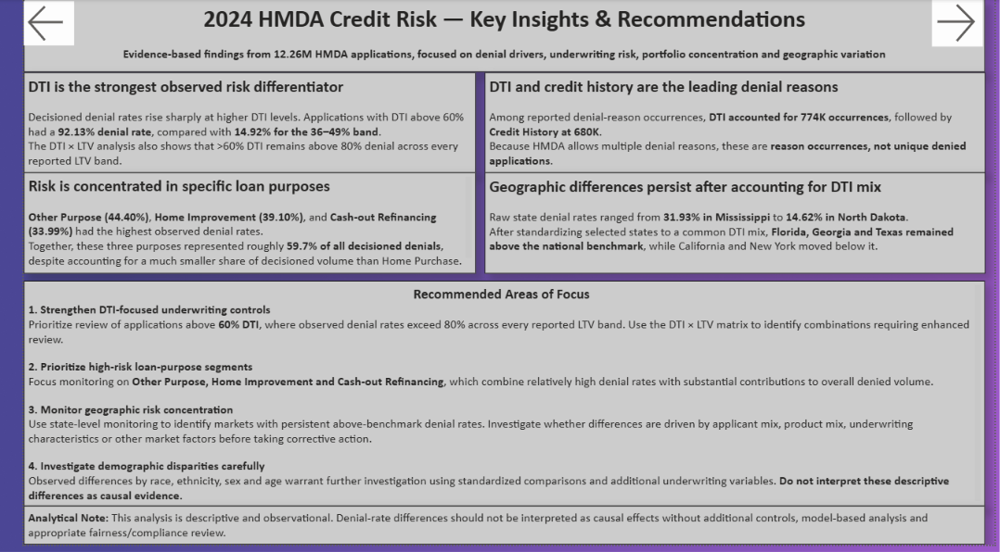
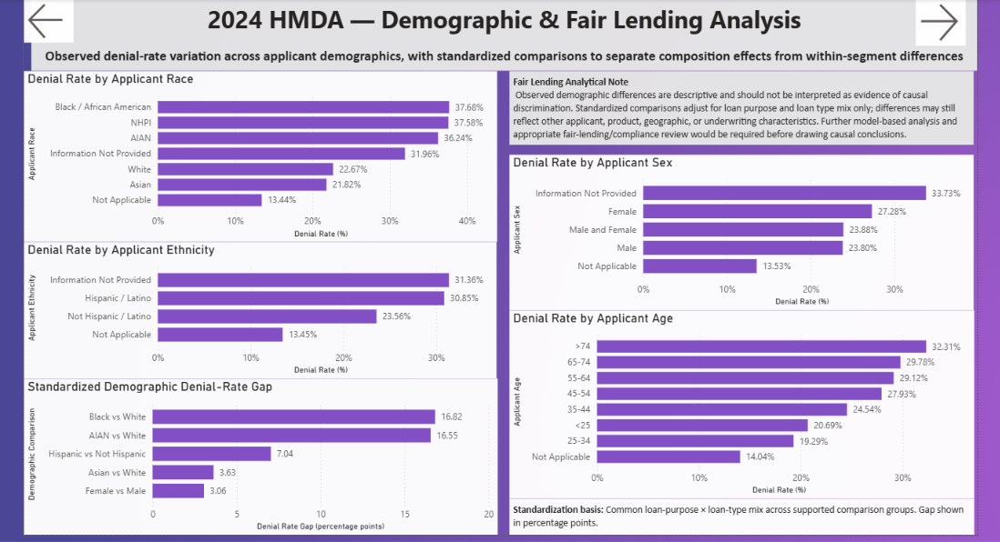
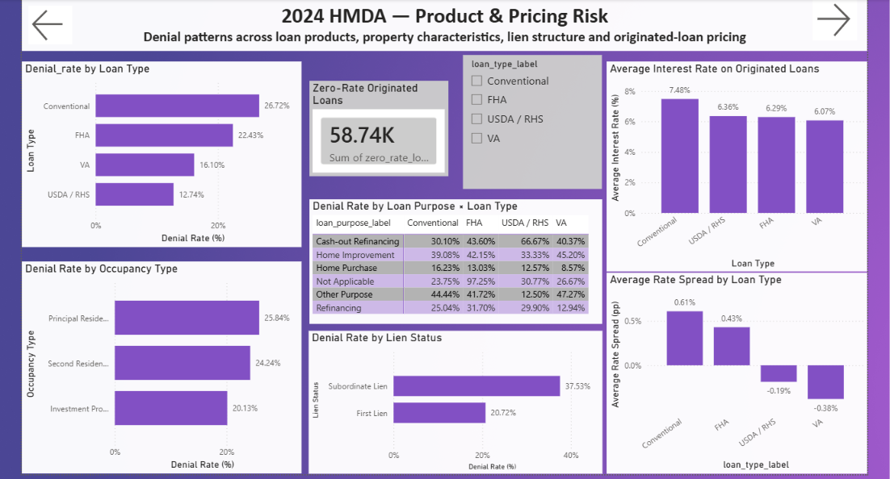
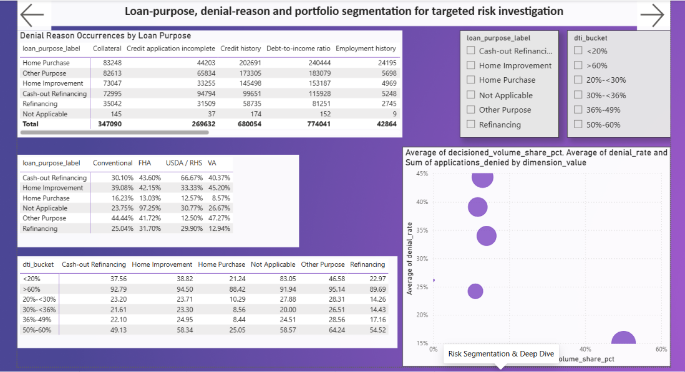

# Mortgage Credit Risk Analytics — 2024 HMDA

**End-to-end mortgage credit risk analysis using Python, MySQL and Power BI on 12.26M 2024 HMDA application records.**

This project looks at mortgage application outcomes from a credit-risk and underwriting perspective. The aim was to take the data through a complete analytics workflow: raw-data profiling, data-quality checks, Python processing, SQL analysis, risk segmentation and an interactive Power BI report.

<p align="center">
  
</p>

---

## Project Overview

The analysis answers practical questions a lending or risk team could ask:

- How large is the application and decisioned portfolio?
- Which loan purposes have the highest observed denial rates?
- How strongly does debt-to-income ratio relate to denial outcomes?
- Does loan-to-value add additional differentiation?
- Which denial reasons occur most often?
- Which states contribute disproportionately to denied applications?
- Do geographic and demographic differences remain after standardizing selected portfolio characteristics?
- How do loan type, occupancy, lien status and pricing differ across products?

### Key numbers

| Metric | Result |
|---|---:|
| Total applications | **12,260,627** |
| Decisioned applications | **8,301,588** |
| Loans originated | **6,197,378** |
| Applications denied | **2,104,210** |
| Decisioned denial rate | **25.35%** |
| Denial share of all applications | **17.16%** |

---

## Dashboard

The Power BI report contains seven pages, including a loan-purpose drill-through page.

### 1. Executive Risk Overview


Portfolio size, denial outcomes, loan-purpose risk, DTI risk, LTV risk and state-level variation.

### 2. Risk Drivers & Concentration



Denial reasons, loan-type risk, DTI × LTV interactions and portfolio concentration.

### 3. Executive Insights & Recommendations



A concise summary of the main findings and practical risk-management recommendations.

### 4. Demographic & Fair Lending Analysis



Observed denial-rate variation across race, ethnicity, sex and age, including standardized comparisons.

### 5. Product & Pricing Risk



Loan type, occupancy, lien structure, loan-purpose/product combinations and originated-loan pricing.

### 6. Risk Segmentation & Deep Dive



Deeper segmentation across loan purpose, loan type, DTI and portfolio exposure.

### 7. Loan Purpose Drill-Through

The final page is an interactive drill-through that lets the user right-click a loan purpose and investigate its DTI profile, denial reasons, loan-type mix and key KPIs.

---

## Main Findings

### DTI is the strongest observed risk differentiator

| DTI bucket | Denial rate |
|---|---:|
| <20% | 30.49% |
| 20–<30% | 16.65% |
| 30–<36% | 14.83% |
| 36–49% | 14.92% |
| 50–60% | 40.04% |
| >60% | **92.13%** |

The strongest signal is the sharp increase at 50–60% and especially >60%. In the DTI × LTV analysis, the >60% DTI group remained above 80% denial across every reported LTV band.

### Risk is concentrated in particular loan purposes

Observed decisioned denial rates:

- **Other Purpose — 44.40%**
- **Home Improvement — 39.10%**
- **Cash-out Refinancing — 33.99%**
- Refinancing — 24.20%
- Home Purchase — 15.02%

Home Purchase represents **50.10% of decisioned volume**, but has a relatively low denial rate. Other Purpose, Cash-out Refinancing and Home Improvement together account for roughly **59.7% of all denied applications**.

### DTI and credit history lead reported denial reasons

- Debt-to-income ratio — **774K occurrences**
- Credit history — **680K**
- Collateral — **347K**
- Other — **276K**
- Credit application incomplete — **270K**

These are **reason occurrences, not unique denied applications**, because multiple denial reasons can be reported for one application.

### Geographic differences are visible

Among states with sufficient decisioned volume, observed denial rates ranged from about **31.93% in Mississippi** to **14.62% in North Dakota**.

A selected-state comparison was also standardized using a common DTI mix. This changed the position of some states, showing why raw geographic comparisons can partly reflect portfolio composition.

### Demographic differences require careful interpretation

After standardizing selected comparisons by loan purpose and loan type, observed gaps included:

| Comparison | Standardized gap |
|---|---:|
| Black vs White | **+16.82 pp** |
| AIAN vs White | **+16.55 pp** |
| Hispanic vs Not Hispanic | **+7.04 pp** |
| Asian vs White | **+3.63 pp** |
| Female vs Male | **+3.06 pp** |

These are descriptive differences, not causal estimates or fair-lending determinations.

---

## Data Source

Primary source:

**2024 Dynamic National Loan-Level Dataset (LAR)**  
https://ffiec.cfpb.gov/data-publication/dynamic-national-loan-level-dataset/2024

The **HMDA Data Browser** was also used as an official reference for definitions and category checks:

https://ffiec.cfpb.gov/data-browser/data/2024?category=nationwide

The downloaded LAR contained **12,260,627 application records and 99 columns**.

---

## Workflow

```text
2024 HMDA Dynamic Loan-Level Dataset
                |
                v
        Raw data profiling
                |
                v
        Data quality checks
                |
                v
        Python processing
                |
                v
        Analytical dataset
                |
                v
             MySQL
                |
        +-------+-------+
        |               |
        v               v
   SQL analysis     Power BI views
                        |
                        v
              Interactive dashboard
```

### Python

Used for:

- raw-file inspection
- sample profiling
- data-quality analysis
- derived analytical fields
- chunked full-dataset processing
- validation

The full dataset was processed in **100,000-row chunks**.

### MySQL

Used for:

- analytical database storage
- executive KPIs
- loan-purpose risk
- DTI and LTV analysis
- denial reasons
- geographic risk
- loan type
- occupancy
- lien status
- pricing
- age, sex, race and ethnicity analysis
- risk-factor interactions
- portfolio concentration
- Power BI reporting views

### Power BI

Used for:

- executive reporting
- risk-driver analysis
- portfolio concentration
- demographic analysis
- product and pricing analysis
- risk segmentation
- slicers
- DAX measures
- drill-through analysis
- Smart Narrative

---

## Data Quality & Validation

The project included explicit checks before and after transformation:

- row-count reconciliation
- missing-value handling
- DTI category validation
- LTV quality checks
- extreme-value identification
- category mapping
- denominator checks
- Python/SQL reconciliation
- Power BI KPI reconciliation

### LTV quality

| Category | Records |
|---|---:|
| Valid | 9,313,164 |
| Missing | 2,743,343 |
| High >100% | 202,176 |
| Extreme >1000% | 1,944 |

Extreme LTV records were excluded from the main LTV interpretation.

**Note:** the analytical LTV metric is derived from loan amount and property value. It should not be described as the official HMDA CLTV field.

---

## Project Structure

```text
Bank-system/
|
├── data/
│   ├── raw/                 # Raw HMDA data - ignored by Git
│   ├── processed/           # Large analytical data - ignored by Git
│   └── samples/             # Small sample/validation outputs
|
├── docs/
│   ├── images/
│   │   ├── img1.png
│   │   ├── img2.png
│   │   ├── img3.png
│   │   ├── img4.png
│   │   ├── img5.png
│   │   └── img6.png
│   ├── Data_quality_log.xlsx
│   └── HMDA_Codebook.xlsx
|
├── python/
├── sql/
├── Power-BI/
│   └── Mortgage_Credit_Risk_Analytics.pbix
|
├── .gitignore
└── README.md
```

---

## Reproducing the Analysis

1. Download the 2024 Dynamic National Loan-Level Dataset from the official source.
2. Place the LAR file under `data/raw/`.
3. Run the Python scripts in `python/` in sequence.
4. Load the analytical dataset into MySQL 8.
5. Run the SQL analysis scripts in `sql/`.
6. Open `Power-BI/Mortgage_Credit_Risk_Analytics.pbix`.
7. Refresh the MySQL-connected Power BI views if reproducing the report.

The large raw and processed datasets are intentionally excluded from GitHub.

---

## Limitations

### Observational analysis

The results show observed associations and differences. They do not establish causation.

### Race and ethnicity

The current analytical dataset uses `applicant_race_1` and `applicant_ethnicity_1`. Therefore these sections are described as **First-Reported Applicant Race** and **First-Reported Applicant Ethnicity**, rather than the official HMDA derived categories.

### Credit score

The available fields include the applicant credit-score model/type, not an actual applicant credit-score value. This project therefore does not analyse applicant credit-score levels.

### Denial reasons

Multiple denial reasons can be reported for one application, so denial-reason charts represent occurrences rather than unique denied applications.

### Geography

State-level differences can reflect differences in applicant and loan mix. Standardization was used in selected analyses, but it does not make the results causal.

---

## Tools

- **Python / pandas** — profiling, transformation and validation
- **MySQL 8.0** — database and analytical SQL
- **Power BI Desktop** — dashboard, DAX, segmentation and drill-through
- **Excel** — data-quality and codebook documentation

---

## Final Takeaway

The main takeaway is that mortgage denial risk is not explained by one simple factor.

The strongest observed signal is the sharp increase in denial rates at high DTI, but loan purpose, LTV, product type, geography and applicant characteristics also show meaningful differences.

The portfolio-concentration analysis adds another useful distinction: **the segments with the highest denial rates are not always the segments with the largest volumes.**

That makes severity and exposure two separate questions for a risk team.

---

## Disclaimer

This is a portfolio analysis project using publicly available HMDA data. It is intended for data-analysis and educational purposes and does not represent lending policy, credit underwriting advice, legal conclusions or a fair-lending determination.
